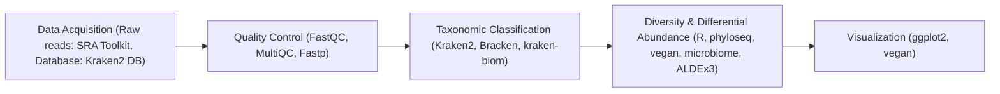
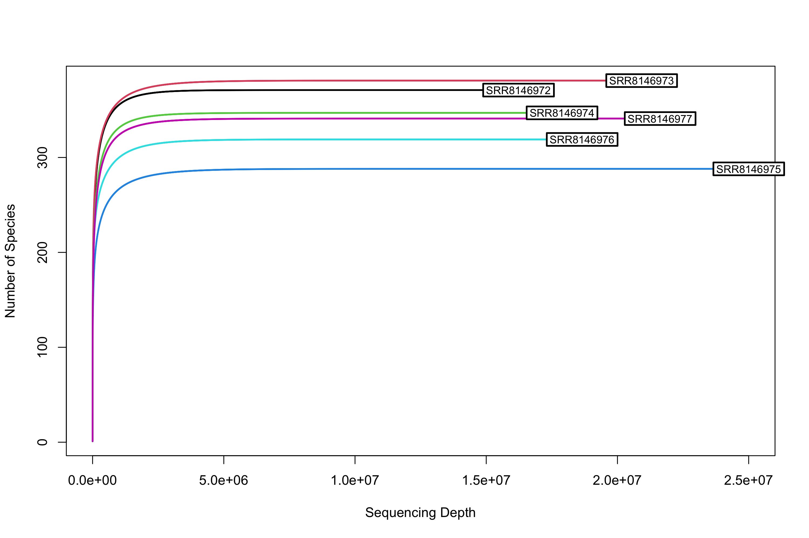
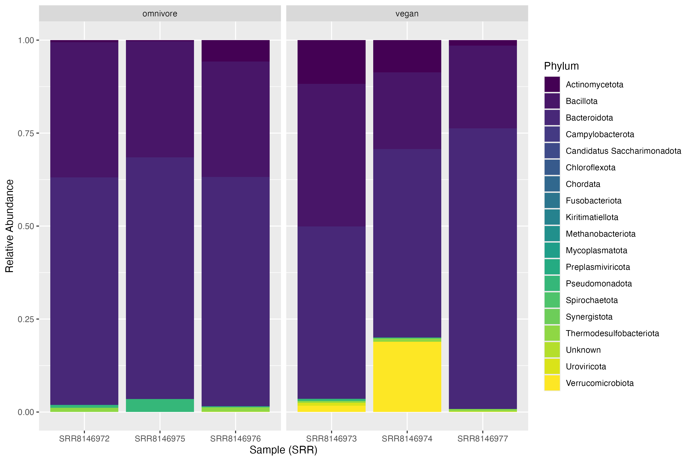
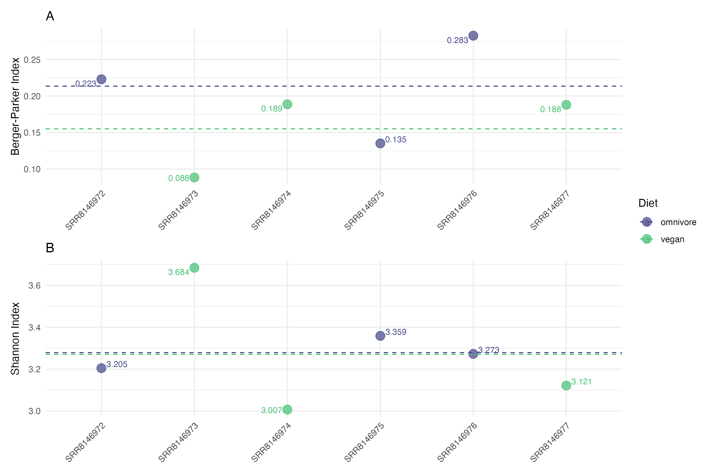
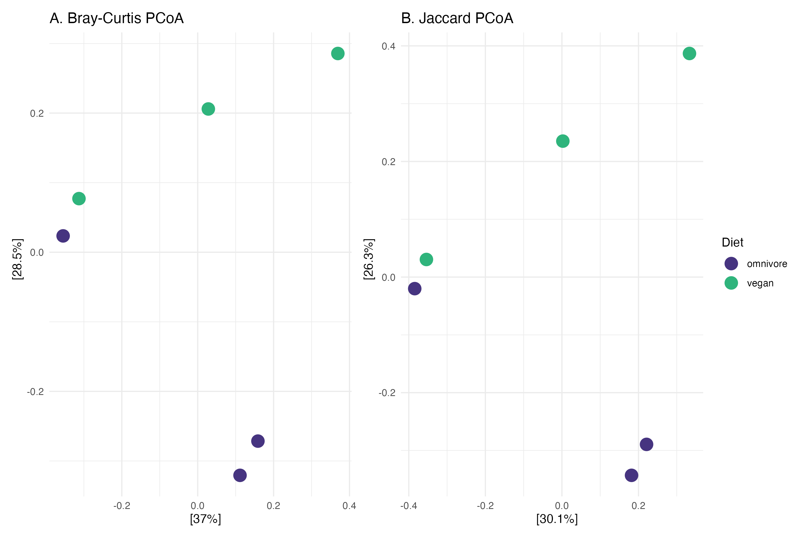
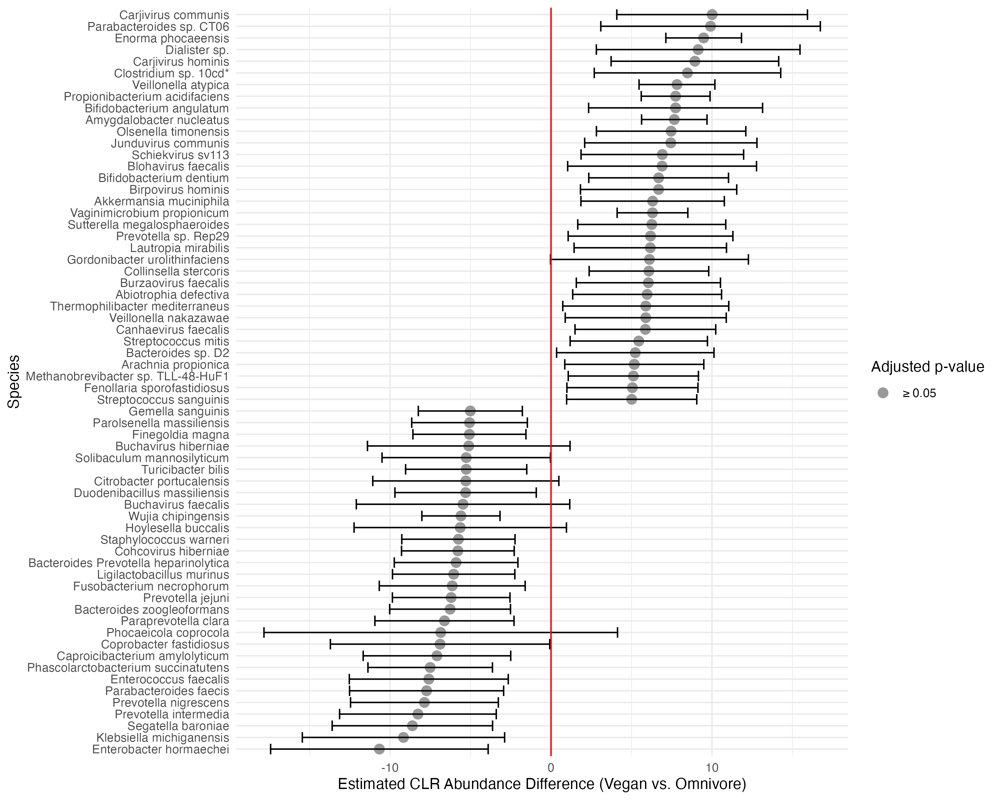

# Exploring The Relationship Between Diet and Gut Microbiome Composition Through Shotgun Metagenomics

## Introduction
Metagenomics is a powerful approach for deepening our understanding of the microbial diversity and community dynamics of the human gut (1-3). Metagenomic approaches aim to characterize the taxonomic composition of samples. In the context of the human gut, this primarily means cataloging and pinpointing the function of bacterial species associated with health and disease (1, 2). Within metagenomics, metabarcoding and shotgun metagenomics are two strategies used to understand the composition and functionality of microbial communities. Metabarcoding relies on the targeted sequencing of amplicons to detect taxa with relatively low coverage; however, it does not provide a direct link to functional profiling and is highly reliant on the chosen amplicon for species recovery (4). Shotgun metagenomics sequences all DNA within samples, allowing for the recovery of rare taxa and direct functional profiles, although it requires substantially higher sequencing depth and produces false positive results (4). For both methods, classification and statistical software and database completeness are major limiting factors, meaning that choosing appropriate tools is critical for an effective study (5-7). This analysis focuses on exploring shotgun metagenomics workflows for investigating the taxonomic composition of the human gut microbiome.

Some of the most common k-mer-based tools for taxonomic classification are Kraken2 (8), KrakenUniq (9), and CLARK (10). When choosing a classifier, precision, recall, accuracy, and false positive rate are important metrics to consider (5). In a benchmarking study, Ye and colleagues found that all three classifiers had a median area under the precision-recall curve (AUPR) score of about 0.95 and L2 values below 0.1. These results underscore the tools’ high precision and recall, as well as accuracy against ground-truth data. While all three tools perform well on the described metrics, computational resources must also be considered. Kraken2 and CLARK ran in a similar amount of time on a dataset with approximately 5.7 million reads (~10¹ minutes), while KrakenUniq ran considerably slower (~10² minutes). Additionally, KrakenUniq requires hundreds of gigabytes of memory. While all three tools are similar in their performance for classification, KrakenUniq is the superior choice due to its reduced false positive and misclassification rate; however, given resource constraints, Kraken2 with Bracken (11) is a suitable alternative (5). For these reasons, this study uses Kraken2 with Bracken for classification.

Database constraints represent a major limiting factor in metagenomic analyses (7). Some available databases for Kraken2 are the standard-16, standard, and nt-core databases. At varying confidence scores, each database performs differently in its ability to identify reads at taxonomic levels (12). Notably, the standard-16 database classifies 0% of reads at 40% confidence, while the standard and nt-core databases classify 80% and 95% at the same confidence level, respectively. Interestingly, it seems that confidence score has a larger impact on precision, recall, and F1 score than the database itself (12). Moreover, computational constraints should be considered, as larger databases will contain more records for accuracy in classification, but require more memory and storage. Here, the Kraken2 standard database was used with a confidence score of 0.15 to balance classification rates, precision, and recall.

Selecting a statistical tool for differential abundance analysis is also crucial. ANCOM-BC2 (13) and ALDEx-2 (14) are both recommended; they give consistent results and help control false positives (6). Recent benchmarking studies show that ALDEx2 is more consistent. For example, when results between exploratory and validation datasets were compared (15), ANCOM-BC2 had higher conflict rates (3%) and lower replication rates (35%). ALDEx2 performed better, with only 0.1% conflict and 79% replication at a false discovery rate (FDR) of 0.05. ALDEx2 is considered conservative, but its successor, ALDEx3 (16), builds on the same framework and adds improvements. ALDEx3 was chosen for this workflow to maintain control of false positives.

Several diseases, such as type 2 diabetes, cardiovascular disease, and irritable bowel disease, have been linked to the composition and functionality of the gut microbiome (17). While the complexities of human gut microbiota are still being explored, diet has emerged as a major contributing factor (17). In particular, Westernized, low-fiber diets are linked to reduced microbial diversity and loss of fibre-degrading taxa (17). Studying gut microbial taxa in people with different diets can help inform recommendations to reduce chronic health issues related to the microbiome. Shotgun metagenomic studies across dietary groups provide insights into specific taxa for further study (18).

The study described here explores a bioinformatic workflow for processing shotgun metagenomics data, and applies this workflow to examine differences in gut microbiome composition between individuals with vegan and omnivore diets.

## Methods
### Computational Resources

Computational workflows, including data acquisition, SRA conversion, quality assessment, read trimming and filtering, taxonomic classification, and abundance estimation, were executed on the Digital Research Alliance of Canada’s Fir cluster (19), with most steps submitted as SLURM jobs. Downstream analyses, including diversity metrics and differential abundance testing, were performed locally on a MacBook Pro (M4 architecture). Mamba v2.4.0 (20) managed virtual environments and software dependencies throughout the workflow (see PIPELINE.md). Git was used for version control (21).

### Data Acquisition

The Kraken2 standard reference v20251015 database was obtained from the Kraken2 documentation index zone (22). The `prefetch` and `fasterq-dump` functions from SRA Toolkit v3.0.9 (23) were used to download and convert SRA files to FASTQ format.

### Quality Control

Quality assessment of reads was conducted for each sample with FastQC v0.12.1 (24) and consolidated into a single report with MultiQC v1.33 (25) before filtering reads. Fastp v1.0.1 (26) was run in parallel mode using `parallel.py` with `--detect_adapter_for_pe` to remove remaining adapters, `--length_required 50` to ensure reads were larger than Kraken2 k-mer size, and `qualified_quality_phred 20` with `--unqualified_percent_limit 20` to remove reads with more than 20 percent of bases with Phred scores below 20. Since Fastp provides its own summary report, MultiQC was not run after trimming and filtering.

### Taxonomic Classification

Kraken2 v2.1.6 (8) was run for each sample, with `confidence 0.15` to reduce the false positive rate, and `--paired` to indicate that each sample includes forward and reverse reads. Bracken v3.0 (11) was run to perform abundance re-estimation with `-r 150` to reflect the length of raw reads, and `-l S` to include only species-level estimates. To convert individual Braken reports to a combined BIOM object for downstream diversity analyses, kraken-biom v1.2.0 (27) was used with `--json` to ensure compatibility with R v4.5.1 (28).

### Diversity and Differential Abundance Analysis

The combined BIOM file was loaded into R and converted into a phyloseq object with the phyloseq package v1.52.0 (29). After creating an operational taxonomic unit (OTU) table, rarefaction was conducted with the vegan v2.7-3 `rarecurve` function (30) to assess sampling completeness. Alpha diversity was measured with the Berger-Parker index to assess dominance, and Shannon index to determine richness and evenness. These metrics were chosen to follow recommendations to include alpha diversity metrics measuring multiple aspects (31). The `dominance` function from the microbiome package v1.30.0 was used with `index = “DBP”` to perform Berger-Parker calculations, and the `estimate_richness` function from phyloseq was used with `measures = c("Shannon")` to calculate Shannon index values. Bray-Curtis dissimilarity and Jaccard similarity were calculated with the `ordinate` function from phyloseq, and PERMANOVA was conducted with the `adonis2` function from vegan to determine the statistical significance of species composition between vegan and omnivore samples. Finally, differential abundance analysis was conducted with ALDEx3 v1.0.2 (16) to determine whether bacterial taxa were significantly enriched or depleted between vegan and omnivore samples, accounting for compositionality and variability in sequencing depth. The “lm” method was specified to assess the linear relationship between diet and abundance with the Benjamini-Hochberg correction. The scale method was set to “clr.sm” and the test parameter was set to "t.HC3" as recommended by the ALDEx3 documentation for small sample sizes (16).

### Visualizations

Visualizations were generated using `rarecurve` from vegan, and `ggplot` from ggplot2 v4.0.2 (32). 

### Pipeline

Figure 1. Workflow used for data acquisition, taxonomic classification and diversity analyses to assess differences in gut microbiome composition in human gut samples of vegan and omnivore groups.

## Results
### Statistics after read trimming and filtering show minimal loss of information and improved quality

Trimming and filtering with Fastp (26) led to an increased proportion of high-quality Phred scores, where post-filtering Q20 rates ranged from 94.7% to 98.0% and Q30 rates ranged from 85.6% to 94.0% across all samples (Table 1). Additionally, GC content was preserved, indicating that there was no notable bias introduced during the filtration and trimming process. As expected by Illumina reads, quality scores were lower for reverse reads across all samples, indicated by the decreased number of total reads after processing (33, Table 1).

Table 1. **Read quality metrics before and after adapter trimming and quality filtering with fastp v1.0.1.** Per-sample summary statistics for all six samples (forward and reverse reads reported separately), including total reads, total bases, Q20 rate, Q30 rate, and GC content. Filtering was performed in paired-end mode with a minimum read length of 50 bp to satisfy Kraken2 k-mer requirements, and a Phred quality threshold of Q20 with a maximum 20% unqualified bases per read. Quality metrics improved consistently across all samples following filtering.

| Sample Reads | Total Reads (Before) | Total Reads (After) | Total Bases (Before) | Total Bases (After) | Q20 Rate (Before) | Q20 Rate (After) | Q30 Rate (Before) | Q30 Rate (After) | GC Content (Before) | GC Content (After)
--- | --- | --- | --- | --- | --- | --- | --- | --- | --- | -- |
SRR8146972 (Forward) | 27.31M | 26.40M | 4.10G | 3.95G | 96.90% | 97.74% | 91.85% | 93.34% | 52.40% | 52.38%
SRR8146972 (Reverse) | 27.31M | 24.60M | 4.10G | 3.69G | 93.90% | 96.91% | 86.43% | 91.31% | 52.48% | 52.35%
SRR8146973 (Forward) | 34.58M | 33.79M | 5.19G | 5.06G | 97.42% | 97.99% | 92.94% | 93.99% | 55.36% | 55.36%
SRR8146973 (Reverse) | 34.58M | 31.83M | 5.19G | 4.77G | 94.73% | 97.12% | 88.12% | 92.05% | 55.46% | 55.36%
SRR8146974 (Forward) | 35.42M | 34.59M | 5.31G | 5.18G | 97.39% | 97.98% | 92.85% | 93.93% | 56.26% | 56.27%
SRR8146974 (Reverse) | 35.42M | 32.56M | 5.31G | 4.87G | 94.66% | 97.07% | 87.95% | 91.92% | 56.36% | 56.27%
SRR8146975 (Forward) | 35.60M | 34.54M | 5.34G | 5.17G | 97.06% | 97.82% | 92.27% | 93.62% | 47.23% | 47.20%
SRR8146975 (Reverse) | 35.60M | 32.45M | 5.34G | 4.86G | 94.35% | 97.08% | 87.36% | 91.80% | 47.32% | 47.15%
SRR8146976 (Forward) | 28.58M | 25.62M | 4.29G | 3.84G | 92.88% | 95.42% | 83.25% | 87.50% | 52.71% | 52.46%
SRR8146976 (Reverse) | 28.58M | 23.23M | 4.29G | 3.48G | 89.23% | 94.66% | 77.18% | 85.58% | 52.82% | 52.34%
SRR8146977 (Forward) | 39.24M | 37.99M | 5.89G | 5.68G | 97.00% | 97.81% | 92.14% | 93.60% | 47.93% | 47.90%
SRR8146977 (Reverse) | 39.24M | 35.70M | 5.89G | 5.36G | 94.35% | 97.11% | 87.37% | 91.89% | 48.01% | 47.80%

### Rarefaction curves indicate sampling completeness
Since each sample was sequenced at different depths, rarefaction curves were generated to assess sampling completeness. Variation in species richness between samples ranges from a minimum of approximately 290 species to a maximum of approximately 375 species (Figure 2). All samples approach an asymptote well before maximum depth, so any differences in composition are unlikely to be caused by sampling bias (Figure 2).

Figure 2. **Rarefaction curves indicate adequate sequencing depth across all samples.** Species richness (number of detected species) plotted as a function of sequencing depth for each of the six samples (SRR8146972–SRR8146977). All curves approach an asymptote well before maximum sequencing depth (~2.5 × 10⁷ reads). Sample SRR8146975 exhibits the lowest species richness (~290 species), while SRR8146973 shows the highest (~375 species).

### Vegan and omnivore diet-groups display differences in phylum-level relative abundance 

Investigation of phylum-level relative abundance revealed that all samples show a high proportion of Bacillota and Bacteroidota (Figure 3). Additionally, phylum Actinomycetota comprises a notable fraction of the relative abundance for samples SRR8146976, SRR8146973, and SRR8146974, with two of the three belonging to the vegan group (Figure 3). The same vegan samples also showed higher abundance of Verrucomicrobiota. In particular, relative abundance for sample SRR8146974 is comprised of approximately 20% Verrucomicrobiota (Figure 3). The remaining phyla are present at small proportions. 

Figure 3. **Phylum-level community composition shows differences between omnivore and vegan diet groups.** Stacked bar plots showing relative abundance at the phylum level for each of the six samples (SRR8146972–SRR8146977). All samples have a high proportion of Bacillota, Bacteroidota. Actinomycetota comprises a notable fraction across some samples, and appears at a higher proportion overall in the vegan group. The vegan group also showed more Verrucomicrobiota abundance, most prominently in sample SRR8146974 which showed approximately 20% relative abundance for this phylum. Minor phyla collectively account for a small proportion of reads across all samples.

### Berger-Parker and Shannon indices indicate differences in species dominance but similar overall diversity between vegan and omnivore groups
Exploration of alpha diversity metrics showed that the omnivore diet group (mean = ~0.22) had higher species dominance than the vegan diet group when measured by the Berger-Parker index (mean = ~0.15, Figure 4A). Conversely, Shannon index values revealed similar overall diversity for both groups (mean = ~3.27, Figure 4B); however, vegan samples displayed a larger range of Shannon index values, indicating higher variability of species-level diversity in this group (Figure 4B).

Figure 4. **Alpha diversity indices reveal higher species dominance in omnivores but similar overall diversity between groups.** Dot plots showing alpha diversity indices for omnivore (purple) and vegan (green) samples, with dashed lines indicating group means. (A) Berger-Parker index, a measure of dominance, was higher in omnivores (mean ~0.22) than vegans (mean ~0.15). (B) Shannon index, a measure for overall diversity accounting for both richness and evenness, was similar between groups (~3.27).

### Bray-Curtis and Jaccard indices reveal high within-group variation and no clear separation by diet group
Following the analysis of alpha diversity metrics, beta diversity analysis was performed to assess differences in community composition. Bray-Curtis distance incorporates both species presence and abundance, while Jaccard distance only considers species presence and absence. Both beta diversity measures were used to calculate dissimilarity between all samples. Bray-Curtis PCoA explains 37% and 28.5% of variance in PC1 and PC2, respectively (Figure 5A), while Jaccard PCoA explains 30.1% and 26.3% of variance in PC1 and PC2, respectively (Figure 5B). Within-group variation appears comparable to or greater than between-group variation, with no clear clustering by diet group observed by either metric (Figure 5). PERMANOVA further confirmed no significant difference in community composition between diet groups for either distance metric (Table 2). 

Figure 5. **Beta diversity metrics show weak separation between omnivore and vegan diet groups.** Principal Coordinates Analysis (PCoA) plot showing community composition dissimilarity within and between omnivore (purple) and vegan (green) diet groups, using two distance metrics. (A) Bray-Curtis PCoA, which accounts for species presence and abundance, explains 37% and 28.5% of variance in PC1 and PC2, respectively. (B) Jaccard PCoA, which only considers species presence or absence, explains 30.1% and 26.3% of variance in PC1 and PC2, respectively. Both metrics reveal high within-group variation and no clear clustering by diet group.

Table 2. **PERMANOVA results for Bray-Curtis and Jaccard distance matrices.** PERMANOVA was performed using the `adonis2` function in the vegan package to test for significant differences in community composition between diet groups.
| Distance Metric | df | R² | F | p-value |
| --- | --- | --- | --- | --- |
| Bray-Curtis | 1 | 0.246 | 1.303 | 0.300 |
| Jaccard | 1 | 0.234 | 1.222 | 0.200 |

### Differential abundance analysis of community composition reveals weak trends in estimated CLR between groups

ALDEx3 was used to calculate Centered Log-Ratio (CLR) estimates for species abundance counts across all samples. The CLR transformation is a normalization method that is applied to compositional data, allowing for the comparison of relative abundance between samples (34). After transformation, there were no significant differences in species abundance between the vegan and omnivore groups; however, some directional trends still emerge (Figure 6). Most notably, some *Prevotella* species show higher relative abundance in the omnivore group, while *Akkermansia muciniphila* has higher relative abundance in the vegan group (Figure 6).

Figure 6. **Estimated CLR abundance values show directional trends but no statistically significant differences in composition between vegan and omnivore diet groups.** Forest plot of estimated CLR (Centered Log-Ratio) abundance differences (vegan vs. omnivore) for the top species by effect size, as determined by ALDEx3 differential abundance analysis. Each point represents a species estimate with 95% confidence intervals. The red vertical line indicates no difference (CLR = 0). Positive values indicate higher relative abundance in vegans, while negative values indicate higher relative abundance in omnivores. All species have adjusted p-values ≥ 0.05 (grey points), indicating no statistically significant differential abundance after Benjamini-Hochberg correction. Notably, most *Prevotella* species trend higher toward omnivores, while *Akkermansia muciniphila* trends higher toward vegans.

## Discussion
This study investigated gut microbiome community composition in individuals with vegan and omnivore diets using a shotgun metagenomics workflow. The pipeline successfully classified over 10 million reads per sample at the species level, and while no statistically significant differences were detected between diet groups, several trends emerged that are consistent with existing literature and warrant further investigation.

The investigation of phylum-level relative abundance between groups showed that Bacillota (also known as Firmicutes) and Bacteroidota were the most represented across all groups (Figure 3). This is consistent with our current understanding that these two phyla represent the highest proportion of relative abundance in the human gut microbiome (35). Actinomycetota (also known as Actinobacteria), which is considered a relevant minority phylum (36, 37), was also noticeably abundant in samples, albeit mostly in the vegan group (Figure 3). Interestingly, there have been contrasting results regarding the effect of diet on the presence of Actinmycetota, with some studies reporting increases among vegan samples, and others reporting a decrease (38). This result suggests that factors other than diet may influence the presence of this phylum. The increased representation of Verrucomicrobiota in vegans is supported by other work investigating the effects of diet on microbiome composition (39). Most research on Verrucomicrobiota investigate its ecological and environmental roles, but some work suggests that *Akkermansia muciniphila* can help to protect against chronic illnesses such as inflammatory bowel disease and type two diabetes (40).

The exploration of alpha diversity revealed that dominance, measured by the Berger-Parker index, was higher in the omnivore group. While the difference was not confirmed with statistical testing, this result suggests that species composition is dominated by one or a few species for the omnivore group, and more evenly spread for the vegan group (Figure 4). No direct link between dominance and diet was identified in the existing literature; however, differences in alpha diversity between vegan and omnivore diet groups have been linked to dietary intake (41). Future work may benefit from explicitly investigating differences in dominance for diet groups, as it may provide insights into the effects of dietary intake on microbiome composition.

Bray-Curtis and Jaccard distances were used to assess between-sample differences in community composition. PERMANOVA analysis provided no evidence of a significant difference between the vegan and omnivore groups (Figure 5, Table 2). A notable limitation of this study was the small sample size for each group (n = 3), as the statistical power of such a small study requires substantial differences between groups to reach significance. Although no significant separation between dietary groups was detected, this may reflect insufficient statistical power rather than a true absence of differences, as significant differences in gut microbiome composition have been linked to diet (41).

To identify specific taxa contributing to compositional differences between groups, differential abundance analysis was conducted using ALDEx3. The results indicated no significant differences between vegan and omnivore groups for CLR estimates of species abundance (Figure 6). Nevertheless, directional trends demonstrated potential differences between groups, which may reflect the low statistical power of the small sample size used here (Figure 6). Specifically, most *Prevotella* species showed higher relative abundance in the omnivore group. Similarly to Fackelman and colleagues’ recent study, *Prevotella copri* was not a strong signature of vegan diets (42). The increased relative abundance of *Prevotella* species in the omnivore group observed here warrants further investigation in a larger cohort to determine whether this reflects a consistent dietary indicator or an artifact of the small sample size. Furthermore, *Akkermansia muciniphila*, a species within Verrucomicrobiota, showed higher relative abundance in the vegan group (Figure 6). *A. muciniphila* is considered a promising probiotic candidate, as it has been linked to improved gut health and an inverse relationship with chronic conditions such as inflammatory bowel disease and type 2 diabetes (43). Future functional experiments would help elucidate the biological mechanisms underlying its abundance and whether diet is an important factor for its colonization and persistence in the human gut.

Overall, this study applied a shotgun metagenomics workflow to investigate gut microbiome composition in vegan and omnivore diet groups. While no statistically significant differences were detected across any of the diversity or differential abundance analyses, consistent trends emerged across multiple metrics. Elevated Verrucomicrobiota and *Akkermansia muciniphila* in vegans, alongside higher species dominance and enrichment of *Prevotella* species in omnivores, suggest that diet may influence gut microbiome composition in ways that are biologically meaningful but require larger sample sizes to detect statistically. Future studies with greater statistical power and functional profiling would help to clarify the relationship between dietary patterns and gut microbiome composition, and further explore the potential health implications of diet-associated taxa.

## References