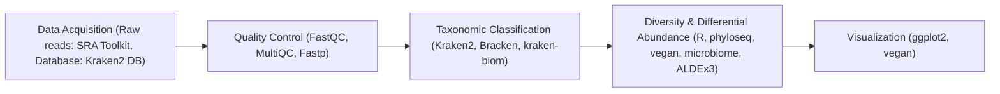

# Linking Diet to Gut Microbiome Composition Through Shotgun Metagenomics

## Introduction
Metagenomics is a powerful approach for deepening our understanding of the microbial diversity and community dynamics of the human gut (1-3). Metagenomic approaches aim to characterize the taxonomic composition of samples. In the context of the human gut, this primarily means cataloging and pinpointing the function of bacterial species associated with health and disease (1, 2). Within metagenomics, metabarcoding and shotgun metagenomics are two strategies used to understand the composition and functionality of microbial communities. Metabarcoding relies on the targeted sequencing of amplicons to detect taxa with relatively low coverage; however, it does not provide a direct link to functional profiling and is highly reliant on the chosen amplicon for species recovery (4). Shotgun metagenomics sequences all DNA within samples, allowing for the recovery of rare taxa and direct functional profiles, although it requires substantially higher sequencing depth and produces false positive results (4). For both methods, classification and statistical software and database completeness are major limiting factors, meaning that choosing appropriate tools is critical for an effective study (5-7). This analysis focuses on exploring shotgun metagenomics workflows for investigating the taxonomic composition of the human gut microbiome.

Some of the most common k-mer-based tools for taxonomic classification are Kraken2 (8), KrakenUniq (9), and CLARK (10). When choosing a classifier, precision, recall, accuracy, and false positive rate are important metrics to consider (5). In a benchmarking study, Ye and colleagues found that all three classifiers had a median area under the precision-recall curve (AUPR) score of about 0.95 and L2 values below 0.1. These results underscore the tools’ high precision and recall, as well as accuracy against ground-truth data. While all three tools perform well on the described metrics, computational resources must also be considered. Kraken2 and CLARK ran in a similar amount of time on a dataset with ~5.7 million reads (~101 minutes), while KrakenUniq ran considerably slower (~102 minutes). Additionally, KrakenUniq requires hundreds of gigabytes of memory. While all three tools are similar in their performance for classification, KrakenUniq is the superior choice due to its reduced false positive and misclassification rate; however, given resource constraints, Kraken2 with Bracken (11) is a suitable alternative (5). For these reasons, this study uses Kraken2 with Bracken for classification.

Database constraints represent a major limiting factor in metagenomic analyses (7). Some available databases for Kraken2 are the standard-16, standard, and nt-core databases. At varying confidence scores, each database performs differently in its ability to identify reads at taxonomic levels (12). Notably, the standard-16 database classifies 0% of reads at 40% confidence, while the standard and nt-core databases classify 80% and 95% at the same confidence level, respectively. Interestingly, it seems that confidence score has a larger impact on precision, recall, and F1 score than the database itself (12). Moreover, computational constraints should be considered, as larger databases will contain more records for accuracy in classification, but require more memory and storage. Here, the kraken2 standard database was used with a confidence score of 0.15 to balance classification rates, precision, and recall.

Selecting a statistical tool for differential abundance analysis is also crucial. ANCOM-BC2 (13) and ALDEx-2 (14) are both recommended; they give consistent results and help control false positives (6). Recent benchmarking studies show that ALDEx2 is more consistent. For example, when results between exploratory and validation datasets were compared (15), ANCOM-BC2 had higher conflict rates (3%) and lower replication rates (35%). ALDEx2 performed better, with only 0.1% conflict and 79% replication at a false discovery rate (FDR) of 0.05. ALDEx2 is considered conservative, but its successor, ALDEx3 (16), builds on the same framework and adds improvements. ALDEx3 was chosen for this workflow to maintain control of false positives.

Several diseases, such as type 2 diabetes, cardiovascular disease, and irritable bowel disease, have been linked to the composition and functionality of the gut microbiome (17). While the complexities of human gut microbiota are still being explored, diet has emerged as a major contributing factor (17). In particular, Westernized, low-fiber diets are linked to reduced microbial diversity and loss of fibre-degrading taxa (17). Studying gut microbial taxa in people with different diets can help inform recommendations to reduce chronic health issues related to the microbiome. Shotgun metagenomic studies across dietary groups provide insights into specific taxa for further study (18).

The study described here explores a bioinformatic workflow for processing shotgun metagenomics data, and applies this workflow to examine differences in gut microbiome composition between individuals with vegan and omnivore diets.

## Methods
### Computational Resources

Computational workflows, including data acquisition, SRA conversion, quality assessment, read trimming and filtering, taxonomic classification, and abundance estimation, were executed on the Digital Research Alliance of Canada’s Fir cluster (19), with most steps submitted as SLURM jobs. Downstream analyses, including diversity metrics and differential abundance testing, were performed locally on a MacBook Pro (M4 architecture). Mamba v2.4.0 (20) managed virtual environments and software dependencies throughout the workflow (see PIPELINE.md). Git was used for version control (21).

### Data Acquisition

The Kraken2 standard reference v20251015 database was obtained from the Kraken2 documentation index zone (22). The `prefetch` and `fasterq-dump` functions from SRA Toolkit v3.0.9 (23) were used to download and convert SRA files to FASTQ format.

### Quality Control

Quality assessment of reads was conducted for each sample with FastQC v0.12.1 (24) and consolidated into a single report with MultiQC v1.33 (25) before filtering reads. Fastp v1.0.1 (26) was run in parallel mode using `parallel.py` with `--detect_adapter_for_pe` to remove remaining adapters, `--length_required 50` to ensure reads were larger than Kraken2 k-mer size, and `qualified_quality_phred 20` with `--unqualified_percent_limit 20` to remove reads with more than 20 percent of bases with Phred scores below 20. Since Fastp provides its own summary report, MultiQC was not run after trimming and filtering.

### Taxonomic Classification

Kraken2 v2.1.6 (8) was run for each sample, with `confidence 0.15` to reduce the false positive rate, and `--paired` to indicate that each sample includes forward and reverse reads. Bracken v3.0 (11) was run to perform abundance re-estimation with `-r 150` to reflect the length of raw reads, and `-l S` to include only species-level estimates. To convert individual Braken reports to a combined BIOM object for downstream diversity analyses, kraken-biom v1.2.0 (27) was used with `--json` to ensure compatibility with R v4.5.1 (28).

### Diversity and Differential Abundance Analysis

The combined BIOM file was loaded into R and converted into a phyloseq object with the phyloseq package v1.52.0 (29). After creating an operational taxonomic unit (OTU) table, rarefaction was conducted with the vegan v2.7-3 `rarecurve` function (30) to assess sampling completeness. Alpha diversity was measured with the Berger-Parker index to assess evenness, and Shannon information to determine richness and evenness. These metrics were chosen to follow recommendations to include alpha diversity metrics measuring multiple aspects (31). The `dominance` function from the microbiome package v1.30.0 was used with `index = “DNP”` to perform Berger-Parker calculations, and the `estimate_richness` function from phyloseq was used with `measures = c("Shannon")` to calculate Shannon information. Bray-Curtis dissimilarity and Jaccard similarity were calculated with the `ordinate` function from phyloseq, and PERMANOVA was conducted with the `adonis2` function from vegan to determine the statistical significance of species composition between vegan and omnivore samples. Finally, differential abundance analysis was conducted with ALDEx3 v1.0.2 (16) to determine whether bacterial taxa were significantly enriched or depleted between vegan and omnivore samples, accounting for compositionality and variability in sequencing depth. The “lm” method was specified to assess the linear relationship between diet and abundance with the Benjamini-Hochberg correction. The scale method was set to “clr.sm” and the test parameter was set to "t.HC3" as recommended by the ALDEx3 documentation for small sample sizes (16).

### Visualizations

Visualizations were generated using `rarecurve` from vegan, and `ggplot` from ggplot2 v4.0.2 (32). 

### Pipeline

Figure 1. Workflow used for data acquisition, taxonomic classification and diversity analyses to assess differences in gut microbiome composition in human gut samples of vegan and omnivore groups.

## References

